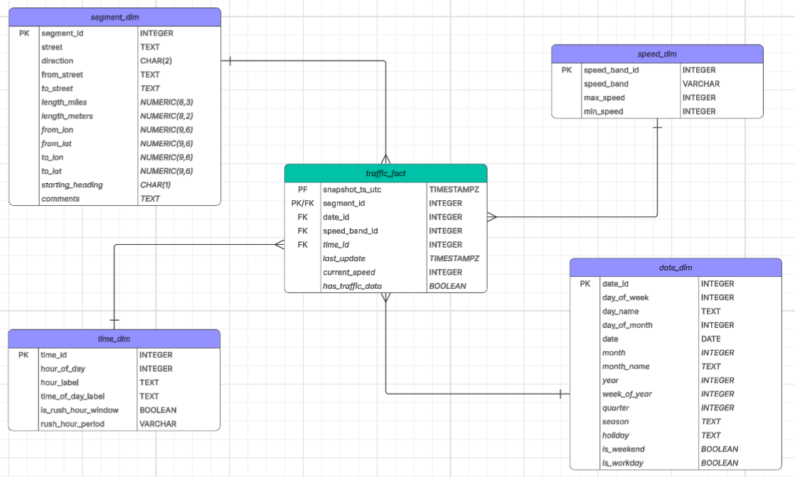

# Chicago Traffic ETL Pipeline

A modular ETL pipeline that extracts Chicago traffic congestion data from the Chicago Open Data API, transforms it using Python and pandas into a dimensional model, and loads structured fact and dimension data into PostgreSQL.

## Pipeline Architecture

Chicago Open Data API
        ↓
     extract.py
        ↓
     Raw JSON
        ↓
  orchestration.py
        ↓
┌─────────────────────────────┐
│ Dimension Transformations   │
│ • segment_dim               │
│ • date_dim                  │
│ • time_dim                  │
│ • speed-band lookup         │
└─────────────────────────────┘
        ↓
 traffic_fact transformation
        ↓
 PostgreSQL Load
        ↓
┌─────────────────────────────┐
│ segment_dim                 │
│ date_dim                    │
│ time_dim                    │
│ speed_dim (seeded by SQL)   │
│ traffic_fact                │
└─────────────────────────────┘

## Data Model

The transformed traffic data is structured as a dimensional model centered on `traffic_fact`, with segment, date, time, and speed-band dimensions.



## Project Goals
- Build a modular end-to-end ETL pipeline using Python and pandas
- Extract and paginate data from a REST API
- Apply data cleaning, validation, and transformation
- Design and implement a dimensional data model with fact and dimension tables
- Load structured fact and dimension data into PostgreSQL
- Practice pipeline orchestration, logging, and maintainable project organization
  
## Technologies Used

- Python
- pandas
- PostgreSQL
- pgAdmin
- Lucidchart
- Git / GitHub
- Chicago Open Data API (Socrata)
- SQLAlchemy
- Psycopg

## Data Source

Chicago Open Data Portal  
Dataset: Chicago Traffic Tracker - Congestion Estimates by Segments

**Source Status:** The City of Chicago has deprecated this dataset, and it stopped receiving new observations in August 2026. As a result, this project is retained as a completed ETL and dimensional-modeling project rather than being deployed as a continuously scheduled pipeline.

[Chicago Traffic Tracker - Congestion Estimates by Segments](https://data.cityofchicago.org/Transportation/Chicago-Traffic-Tracker-Congestion-Estimates-by-Se/n4j6-wkkf/about_data)

## Project Structure

```chicago-traffic-etl/
│
├── src/
│   ├── common.py
│   ├── extract.py
│   ├── load.py
│   ├── orchestration.py
│   ├── profile_source.py
│   ├── speed_band_lookup.py
│   ├── transform_date_dim.py
│   ├── transform_segment_dim.py
│   ├── transform_time_dim.py
│   └── transform_traffic_fact.py
│
├── sql/
│   └── create_tables.sql
│
├── docs/
│   └── Chicago_Traffic_ERD.png
│
├── data/
│   └── raw/                 # Generated data; ignored by Git
│
├── logs/                    # Runtime logs; ignored by Git
│
├── .gitignore
├── requirements.txt
└── README.md```

## Transformations

### Segment Dimension
- Normalize source column names
- Standardize string formatting
- Cast numeric data types
- Derive segment length in meters

### Date Dimension
- Generate calendar dates from 2010–2030
- Derive day, month, year, quarter, and week attributes
- Identify weekends and workdays
- Add federal and selected non-federal holidays
- Assign seasons

### Time Dimension
- Generate hourly records for a 24-hour day
- Create formatted hour and time-of-day labels
- Identify morning and evening rush-hour windows

### Speed Band Dimension
- Define speed ranges for No Data, Very Slow, Slow, Moderate, and Fast traffic

### Traffic Fact
- Normalize and standardize raw traffic observations
- Cast numeric and datetime data types
- Convert traffic speed from MPH to KPH
- Identify observations with available traffic data
- Add UTC pipeline snapshot timestamps
- Assign date, time, and speed-band dimension IDs
- Validate dimension mappings and required fact columns

## Database Configuration

Database credentials and connection settings are managed through environment variables rather than being stored in the source code.

Create a `.env` file in the project root with the following variables:

```env
DB_HOST=localhost
DB_PORT=5432
DB_NAME=chicago_traffic
DB_USER=your_username
DB_PASSWORD=your_password
```

The `.env` file is excluded from version control through `.gitignore`.

The pipeline uses SQLAlchemy with Psycopg to connect to PostgreSQL. On execution, the SQL schema is created from `sql/create_tables.sql`, which also populates the static `speed_dim` lookup table.

## Running the Pipeline

The pipeline is executed from the project root through the orchestration module:

```bash
python src/orchestration.py
```

The pipeline will:

1. Extract traffic data from the Chicago Open Data API
2. Create the segment, date, and time dimension DataFrames
3. Create the speed-band lookup used during fact transformation
4. Transform the traffic observations into the `traffic_fact` DataFrame
5. Create the PostgreSQL tables and seed the `speed_dim` lookup using SQL
6. Load the dimension tables into PostgreSQL
7. Load `traffic_fact` after its referenced dimensions are populated

Database connection settings are supplied through environment variables and are not stored in the source code.

> **Note:** The source dataset was deprecated by the City of Chicago in August 2026, so the complete pipeline can no longer be executed against current traffic observations.

## Future Improvements

- Adapt the pipeline to an actively maintained traffic data source
- Implement incremental loading and idempotent database operations
- Add automated data quality checks and exception handling
- Containerize the pipeline with Docker
- Add automated testing for transformation and loading functions
- Build a dashboard or analytical layer on top of the dimensional model

## Key Learning Outcomes

- Designed and implemented a dimensional data model with fact and dimension tables
- Refactored a monolithic transformation workflow into modular, responsibility-focused components
- Built reusable Python functions for extraction, transformation, orchestration, and database loading
- Implemented pipeline logging for execution tracking and row-count validation
- Used SQLAlchemy and Psycopg to integrate a Python pipeline with PostgreSQL
- Used SQL to define relational tables, primary keys, foreign keys, and a static lookup dimension
- Managed database configuration securely using environment variables
- Applied data cleaning, type conversion, feature engineering, and dimension-key mapping
- Structured ETL execution so dimensions are populated before dependent fact data

  
